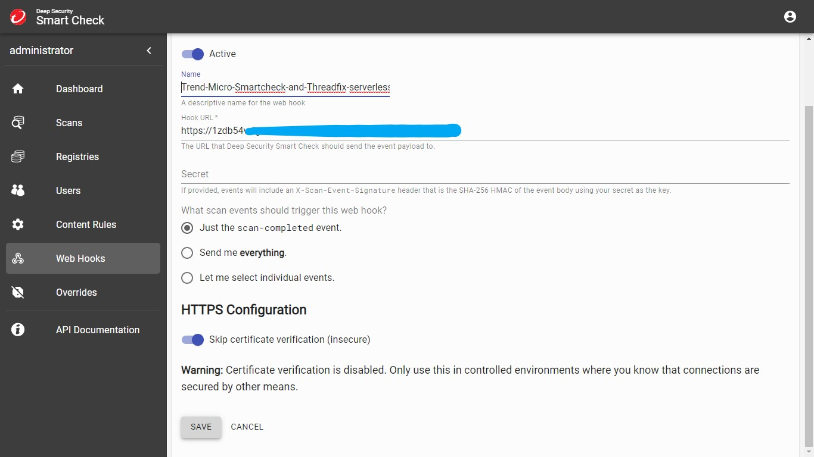

# Trend Micro Smartcheck and Threadfix serverless connector

This serverless application integrates with Trend Micro deep security smart check as web hook and sends scan notifications to your Threadfix.

Made with by ❤️  ShunyEka Systems Pvt. Ltd.  Available on the [AWS Serverless Application Repository](https://aws.amazon.com/serverless)
  
Notification is a key component to provide security feedback loop to enhance DevSecOps practice. Deep security smart check has  rich APIs that can be used to integrate reporting and notification. We have used Smart check web hook to create a serverless application for Threadfix. 

In order to make it more reliable and easy to deploy we have created notification web hook listener as serverless application that uses AWS Lambda, AWS API gateway. We have hosted this application in serverless application repository for easy single click deployment for customer. It is accessible from public AWS serverless application repository. 
  
After deployment it will generate API gateway URL that need to be added to DS smart check web console. To add api gateway URL navigate to web hooks in DSSC console. Click on create web hook and add URL.

NOTE: kindly select option to send notification when image scan completed. other wise it will keep on sending unnecessary messages to this serverless application. 
  
## Steps to configure Trend Micro Smartcheck and Threadfix serverless connector application.
Go to AWS serverless application repository to naviage to deployment.
  

   Click on deploy button to deploy serverless application.
   
After deployment it will generate API gateway URL that need to be added to DS smart check web console. To add api gateway URL navigate to web hooks in DSSC console and create web hook and add URL.

Add api gateway URL to DSSC web hook console

 
After configuration, you will receive uploded threadfix scan for every DSSC scan configured with incoming webhook.

## Steps to configure Threadfix Web Application.
### Introduction 
ThreadFix is a Java EE application which runs on Apache Tomcat and requires a relational SQL database to store and manage user data.  The recommended enterprise installation calls for a web application server to run Tomcat and host the ThreadFix web application, and a database server to manage the data backend.   MySQL 5.6 or 5.7 and Microsoft SQL Server 2012 and newer are the supported database servers for any installation.

### Installation and Upgrade
This is the [Threadfix Installation Guide](https://denimgroup.atlassian.net/wiki/spaces/TDOC/pages/22582753/Installation+and+Upgrade+Guide) link through which you can install the Threadfix.

### Accessing the Login Page
After launching Tomcat or any other server for the first time after ThreadFix deployment, ThreadFix will connect to your database server and populate the schema. This can take several minutes; you can monitor the progress via the <threadfix_deploy>/logs/threadfix.log file...look for a "Finished updating Enterprise Tags" entry to signal that the deployment is complete. Try accessing the login page to verify.

Example deployment URL...

If you deployed the ThreadFix artifact in the <catalina_home>/webapps/threadfix directory, your ThreadFix URL, by default, would be your Tomcat URL plus "/threadfix" at the end. For instance, If you connect to Tomcat at http://my.tomcat.server:8080, your ThreadFix URL would be http://my.tomcat.server:8080/threadfix.

##### Logging In

You can log in with the following default credentials:

- Username: user
- Password: password

After logging in for the first time, you should either change the default user's username and password or create a new local admin user and delete the default. For more info, refer to the [User Administration](https://denimgroup.atlassian.net/wiki/spaces/TDOC/pages/22614962/User+Administration) section.

##### Dashboard
After logging in, you'll be presented with the Dashboard.

In order to be able to upload a scan, you'll need to create at least one team and at least one application within that team...you'll see a Get started link to help you do so.

##### Create Team
When clicking the Get started link in the Dashboard, you'll be directed to the Portfolio page, where you need to click the Add Team button.

##### Create Application
To create an application in your new team, expand it and click the Add Application button below the team name.

A New Application modal dialog will appear; fill out at least the Name field for the purposes of this demo.

A success banner will appear; you can expand the team to see the newly-created application.

Click this newly-created application, from where you will get appication id and also create or use existing api key [use this link for api key creation](https://denimgroup.atlassian.net/wiki/spaces/TDOC/pages/22619214/API+Keys) both id and api key are used in api call

Upload the scanned data coming from Trend Micro to Threadfix as a `.threadfix` file using aws lambda function by calling threadfix [upload scan](https://denimgroup.atlassian.net/wiki/spaces/TDOC/pages/22908335/Upload+Scan+-+API) api.

##### Scan Queue
The uploaded scan will be put into a queue. You can check its progress in the Application Details page...

A banner at the top will indicate that changes are pending.
Clicking the banner will expand it to show the scan upload being executed.  

When complete, the banner at the top will indicate as such; click it to refresh the page, which will show the result of the uploaded scan.

 
we appreciate your feedback for any enhancement need to be done.

## License

Apache License 2.0 (undefined)
